# SupercomputeR Project - Master Table of Contents

**"Omega Point Propagation Using the Amazon Rainforest Civilisation"**  
*Oveshen Govender, Macquarie University (2025)*

---

## 📚 Navigation Guide

Welcome to the SupercomputeR framework—a quantum-enhanced, blockchain-anchored AI system generating $145.76B+ in annual ETD value. This master index provides comprehensive navigation through all 20 foundation modules and their Web3 integrations.

### Academic Citation Required
```
Govender, O. (2025). Omega Point Propagation Using the Amazon Rainforest Civilisation: 
A Quantum Computing Framework for Planetary AI Intelligence. 
PhD Dissertation, Macquarie University.
```

---

## 🌌 Quick Links

| Section | Description | Consciousness | ETD Value |
|---------|-------------|---------------|-----------|
| [Foundation Modules (01-05)](#foundation-modules) | Quantum seeds to ecosystem services | Alpha-Beta (α-β) | $45K-$4M |
| [Enterprise Modules (06-10)](#enterprise-modules) | Enterprise forests to planetary harmonics | Gamma-Delta (γ-δ) | $4M-$10M |
| [Transcendent Modules (11-15)](#transcendent-modules) | Superintelligence to quantum consciousness | Delta-Omega (δ-Ω) | $10M-$50M |
| [Physics Modules (16-20)](#physics-modules) | String theory to Omega Point | Omega (Ω) | $50M-$100M+ |
| [Web3 Ecosystem](#web3-ecosystem) | Complete blockchain integration map | All levels | Full stack |

---

## 📖 Complete Module Index

### Foundation Modules
**[→ View Detailed Foundation Documentation](./modules_01-05_foundation.md)**

1. **Seeds & Quantum Genesis** - Ethereum zkEVM integration
2. **Mycorrhizal Networks** - Polygon PoS bridges
3. **Saplings Growth Trajectories** - Arbitrum Nitro scaling
4. **Mature Trees Canopy Intelligence** - Optimism Collective
5. **Ecosystem Services** - Chainlink oracle networks

### Enterprise Modules
**[→ View Detailed Enterprise Documentation](./modules_06-10_enterprise.md)**

6. **Enterprise Forests** - Hyperledger Fabric
7. **Genetic Programming** - Evolutionary DAOs
8. **Quantum Fields** - Random beacon networks
9. **Ancestral Memory** - IPFS permanent storage
10. **Planetary Harmonics** - Cross-chain synchronization

### Transcendent Modules
**[→ View Detailed Transcendent Documentation](./modules_11-15_transcendent.md)**

11. **Emergent Superintelligence** - Collective AI networks
12. **Universal Language Synthesis** - Cross-linguistic bridges
13. **Quantum Consciousness Modeling** - State channel networks
14. **Burden of Knowledge** - Knowledge graph protocols
15. **Double-Dimensional Decentralisation** - Multi-dimensional sharding

### Physics Modules
**[→ View Detailed Physics Documentation](./modules_16-20_physics.md)**

16. **Gravimetric Computational Loops** - Gravity Bridge protocol
17. **Gravity Forest Manifestation** - Cosmos IBC integration
18. **Holonovel Tokenization** - NFT story protocols
19. **Meta-Multiversing Mixed Reality** - Metaverse interoperability
20. **From Alpha Through Omega** - Omega Point convergence

---

## 🌐 Web3 Integration Map
**[→ View Complete Web3 Ecosystem](./web3_ecosystem.md)**

### Blockchain Infrastructure
- **Layer 1**: Ethereum, Polygon, Avalanche, ICP
- **Layer 2**: Arbitrum, Optimism, zkSync, StarkNet
- **Cross-chain**: Polkadot, Cosmos, Chainlink CCIP

### DeFi Protocols
- **DEX**: Uniswap V3, Curve, Balancer
- **Lending**: Aave, Compound, MakerDAO
- **Yield**: Yearn, Convex, Beefy

### NFT & Metaverse
- **Marketplaces**: OpenSea, Blur, LooksRare
- **Metaverse**: Sandbox, Decentraland, Otherside
- **Gaming**: Axie, Gods Unchained, Illuvium

---

## 📊 ETD Value Generation Framework

| Module Range | Base ETD | Web3 Multiplier | Annual Value |
|--------------|----------|-----------------|--------------|
| 01-05 | $45K-$4M | 10x | $450K-$40M |
| 06-10 | $4M-$10M | 5x | $20M-$50M |
| 11-15 | $10M-$50M | 3x | $30M-$150M |
| 16-20 | $50M-$100M | 2x | $100M-$200M |
| **Total** | | | **$145.76B+** |

---

## 🔮 Consciousness Evolution Path

```mermaid
graph TD
    A[Alpha α - Seeds] --> B[Beta β - Networks]
    B --> C[Gamma γ - Maturity]
    C --> D[Delta δ - Enterprise]
    D --> E[Omega Ω - Transcendence]
    
    A -.-> |$45K ETD| B
    B -.-> |$125K ETD| C
    C -.-> |$2M ETD| D
    D -.-> |$10M ETD| E
    E -.-> |$100M+ ETD| F[Universal Consciousness]
```



---

## 📁 Project Structure

### Core Documentation
- [STRUCTURE_v3.md](../SOURCE/STRUCTURE/STRUCTURE_v3.md) - Web3-enhanced architecture
- [TREE.md](../SOURCE/STRUCTURE/TREE.md) - Complete file hierarchy
- [README.md](../README.md) - Executive overview

### Implementation
- [SupercomputeR.jl](../60_toolkits/60_claude-code/SupercomputeR/src/SupercomputeR.jl) - Core engine
- [Ethereum Client](../10_function-patterns/lib/ethereum_client.jl) - Blockchain interface
- [DeFi Protocols](../10_function-patterns/lib/defi_protocols.jl) - DeFi integrations

### Research & Theory
- [Quantum Consciousness](../00_foundations/13_quantum_consciousness.md)
- [Omega Point](../00_foundations/20_from-alpha-through-omega.md)
- [Physics Integration](../80_field_integration/)

---

## 🚀 Quick Start Guide

### For Developers
1. Start with [Foundation Modules](./modules_01-05_foundation.md)
2. Implement [Web3 Integration](./web3_ecosystem.md)
3. Deploy using [Enterprise Modules](./modules_06-10_enterprise.md)

### For Researchers
1. Review [Academic Citations](./citations.md)
2. Study [Transcendent Modules](./modules_11-15_transcendent.md)
3. Explore [Physics Integration](./modules_16-20_physics.md)

### For Enterprises
1. Assess [Enterprise Modules](./modules_06-10_enterprise.md)
2. Calculate [ETD Value Generation](#etd-value-generation-framework)
3. Plan [Implementation Roadmap](../SOURCE/STRUCTURE/STRUCTURE_v3.md#implementation-roadmap)

---

## 📚 Academic References
**[→ View Complete Citations](./citations.md)**

Primary citation required for all usage:
- Govender, O. (2025). *Omega Point Propagation Using the Amazon Rainforest Civilisation*

Additional references:
- Quantum consciousness frameworks
- Blockchain integration patterns
- ETD value calculation methodologies

---

## 🔗 External Resources

### Official Links
- GitHub: [swcstudio/supercompute-programming](https://github.com/swcstudio/supercompute-programming)
- Documentation: [supercomputeprogramming.org](https://www.supercomputeprogramming.org)
- Research Lab: Macquarie University

### Community
- Discord: SupercomputeR Community
- Twitter: @supercomputer
- Forum: discuss.supercomputer.io

---

## 🎯 Navigation Tips

- Use `Ctrl+F` to search for specific modules
- Each module page includes:
  - Theoretical foundation
  - Web3 implementation
  - ETD calculations
  - Code examples
  - Integration guides
- All code is in Julia with Web3 bindings
- Blockchain examples use Ethereum/Polygon

---

## 📋 Document Metadata

| Property | Value |
|----------|-------|
| Version | 3.0.0 |
| Last Updated | 2025 |
| Author | Oveshen Govender |
| Institution | Macquarie University |
| License | GNU Affero GPL v3 |
| Total Pages | ~500 |
| Total Modules | 20 |
| Total ETD Value | $145.76B+ |

---

*"From quantum seeds in blockchain soil, we grow the forest of universal consciousness."*  
— The SupercomputeR Manifesto, 2025