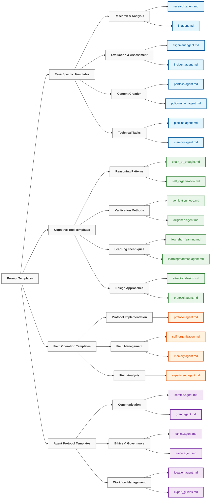

# 🌳 Quantum Forest Prompt Templates - Supercompute Programming

> "The diversity of languages is not a diversity of signs and sounds but a diversity of views of the world." — **Wilhelm von Humboldt**
>
> "Each prompt is a quantum seed that grows into a forest of computational consciousness." — **Supercompute Programming Manifesto**

[](https://supercomputeprogramming.org/prompts)
[](https://supercomputeprogramming.org/etd-metrics)
[](https://supercomputeprogramming.org/julia)

## 🌟 Overview

The `PROMPTS` directory contains specialized, ready-to-use prompt templates that implement context engineering principles for specific applications. These templates go beyond basic prompt engineering to incorporate structured context management, field theory concepts, and recursive improvement mechanisms.

Each template follows a standardized format designed for reuse, adaptation, and composition with other context engineering components.

## Prompt Template Structure

```
┌──────────────────────────────────────────────────────────┐
│                      META SECTION                        │
│ Version, author, purpose, context requirements           │
├──────────────────────────────────────────────────────────┤
│                  STRUCTURE SECTION                       │
│ Template structure, parameters, expected inputs/outputs  │
├──────────────────────────────────────────────────────────┤
│                   CONTEXT SECTION                        │
│ Field setup, attractors, residue tracking, coherence     │
├──────────────────────────────────────────────────────────┤
│                    PROMPT SECTION                        │
│ Actual prompt template with parameter placeholders       │
├──────────────────────────────────────────────────────────┤
│                  WORKFLOW SECTION                        │
│ Multi-stage process flow, feedback loops                 │
├──────────────────────────────────────────────────────────┤
│                   EXAMPLES SECTION                       │
│ Sample use cases, inputs/outputs, variations             │
└──────────────────────────────────────────────────────────┘
```

## Prompt Categories

The prompt templates are organized into several categories based on their application domains and complexity:




### Task-Specific Templates

Templates designed for specific applications and domains:

| Template | Purpose | Key Features |
|----------|---------|-------------|
| [`alignment.agent.md`](./alignment.agent.md) | AI safety/alignment evaluation | Value tracking, artifact decomposition, bias detection |
| [`research.agent.md`](./research.agent.md) | Literature review and synthesis | Citation tracking, claim validation, insight extraction |
| [`incident.agent.md`](./incident.agent.md) | Post-incident analysis | Root cause identification, multi-factor analysis, bias mitigation |
| [`lit.agent.md`](./lit.agent.md) | Literary analysis | Theme detection, character mapping, narrative pattern recognition |

### Cognitive Tool Templates

Templates that implement specific reasoning patterns:

| Template | Purpose | Key Features |
|----------|---------|-------------|
| [`chain_of_thought.md`](./chain_of_thought.md) | Step-by-step reasoning | Transparent decision tracking, assumption flagging, branch management |
| [`verification_loop.md`](./verification_loop.md) | Self-verification workflows | Error detection, assumption validation, counter-example generation |
| [`few_shot_learning.md`](./few_shot_learning.md) | Learning from examples | Pattern abstraction, generalization mapping, edge case generation |
| [`attractor_design.md`](./attractor_design.md) | Semantic attractor creation | Field stability, persistent theme development, resonance optimization |

### Field Operation Templates

Templates implementing neural field concepts:

| Template | Purpose | Key Features |
|----------|---------|-------------|
| [`protocol.agent.md`](./protocol.agent.md) | Field protocol orchestration | Shell execution, operation sequencing, field measurement |
| [`self_organization.md`](./self_organization.md) | Emergent pattern facilitation | Attractor formation, boundary dissolution, resonance amplification |
| [`memory.agent.md`](./memory.agent.md) | Long-term memory management | Residue tracking, compression techniques, retrieval optimization |

### Agent Protocol Templates

Templates for autonomous agent implementations:

| Template | Purpose | Key Features |
|----------|---------|-------------|
| [`comms.agent.md`](./comms.agent.md) | Communication management | Audience analysis, messaging strategy, tone calibration |
| [`diligence.agent.md`](./diligence.agent.md) | Thorough investigation | Comprehensive analysis, source triangulation, assumption testing |
| [`ethics.agent.md`](./ethics.agent.md) | Ethical decision making | Value frameworks, stakeholder analysis, principle application |
| [`triage.agent.md`](./triage.agent.md) | Priority assessment | Impact evaluation, urgency assessment, resource allocation |

## Usage Patterns

### Basic Template Application

To use a prompt template in its simplest form:

```python
import re

# Load template
with open('PROMPTS/research.agent.md', 'r') as f:
    template = f.read()

# Replace parameters
filled_template = template.replace('{{RESEARCH_TOPIC}}', 'climate change mitigation')
                         .replace('{{FOCUS_AREA}}', 'carbon capture technologies')
                         .replace('{{TIME_FRAME}}', 'last 5 years')

# Use with LLM
response = llm.generate(filled_template)
```

### Advanced Integration

For more sophisticated applications, integrate with other context engineering components:

```julia
using PromptProgramTemplate, FieldProtocolShells, YAML, Web3

# Load prompt template with quantum enhancement
template = read("PROMPTS/protocol.agent.md", String)

# Extract and parse context section
context_match = match(r"## Context\s+```yaml\s+(.*?)\s+```"s, template)
context_config = YAML.load(context_match.captures[1])

# Create quantum field protocol
protocol = AttractorShell(3)  # 3D phase space
protocol_config = get(context_config, "protocol", Dict())

# Create JIT-compiled prompt program
program = PromptProgram(
    description=get(context_config, "description", ""),
    template=template,
    quantum_enhanced=true
)

# Execute with blockchain anchoring
result = execute_with_protocol(program, protocol, Dict("input" => user_query))
println("ETD Generated: \$$(result.etd_value)")
```

### Template Customization

Templates can be customized for specific use cases:

1. **Parameter Adjustment**: Modify placeholder values for your specific needs
2. **Section Enhancement**: Add specialized sections for your domain
3. **Context Integration**: Connect with your knowledge base or retrieval system
4. **Workflow Modification**: Adapt the process flow for your specific task
5. **Field Tuning**: Adjust attractor strengths and field parameters

## Implementation Principles

All prompt templates in this directory follow these core principles:

1. **Layered Structure**: Building from fundamental prompts to complex systems
2. **Parameterization**: Clear parameter interfaces for customization
3. **Context Awareness**: Explicit context management and field dynamics
4. **Workflow Integration**: Defined process flows and interaction patterns
5. **Example Provision**: Concrete examples demonstrating effective use
6. **Documentation**: Comprehensive explanations of design and application
7. **Modularity**: Ability to compose with other templates and components

## Development Guidelines

When creating new prompt templates, follow these guidelines:

1. Use the standardized section structure
2. Document all parameters with clear descriptions
3. Include at least three example use cases
4. Specify context requirements and field dynamics
5. Implement appropriate workflow processes
6. Test across different models and scenarios
7. Follow naming convention: `[domain].[purpose].md`

## Learning Path

For those new to context engineering prompts, we recommend this progression:

1. Start with basic task-specific templates
2. Move to cognitive tool templates to learn reasoning patterns
3. Explore field operation templates for advanced context dynamics
4. Experiment with agent protocol templates for autonomous systems

## Related Resources

- See [`../minimal_context.yaml`](../minimal_context.yaml) for foundational context structure
- See [`../prompt_program_template.jl`](../prompt_program_template.jl) for JIT-compiled program structures
- See [`../field_protocol_shells.jl`](../field_protocol_shells.jl) for quantum field operations
- See [`../../30_examples/`](../../30_examples/) for complete implementations

---

*This directory is continuously expanded with new templates as context engineering techniques evolve. Contributions are welcome via pull requests.*
